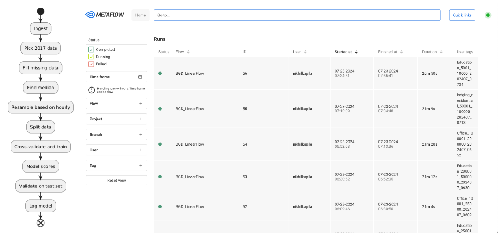
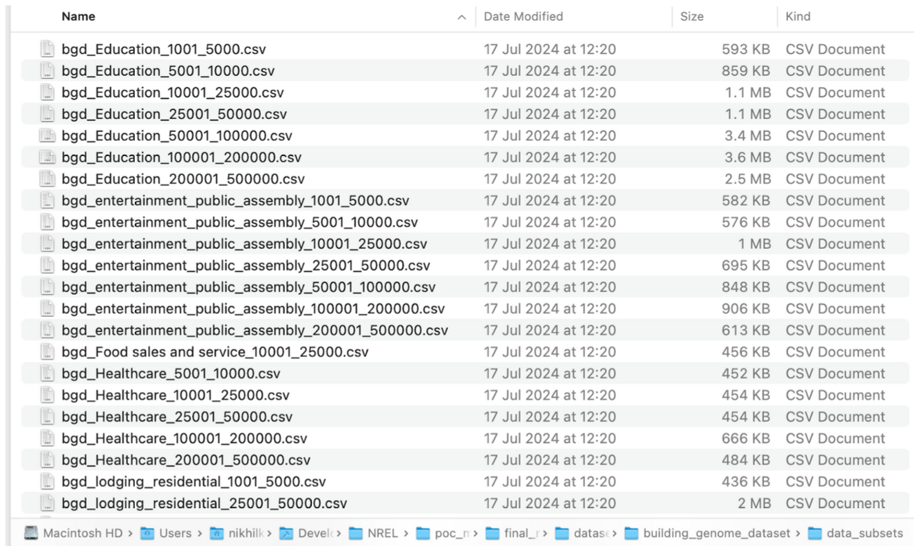
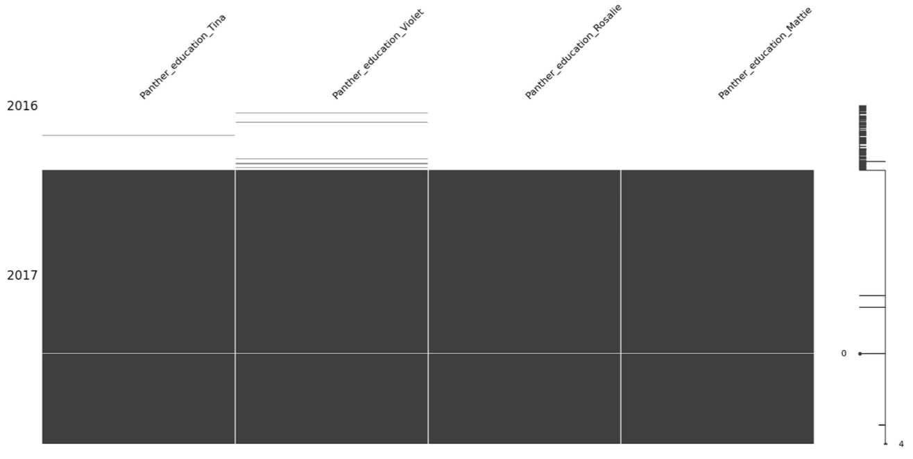
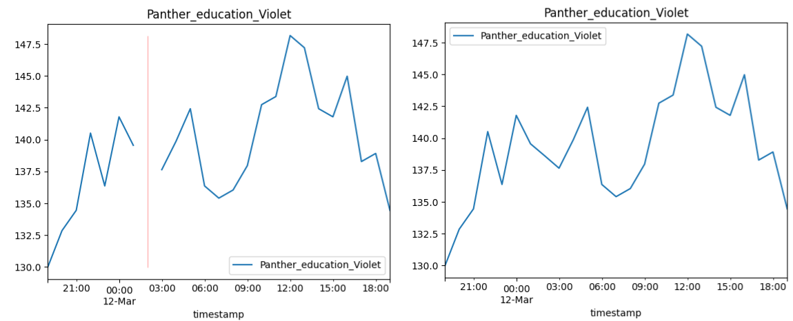
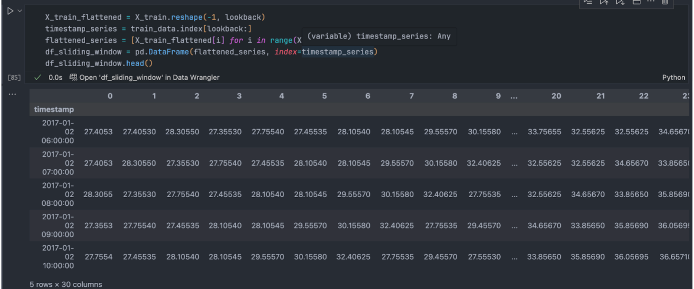
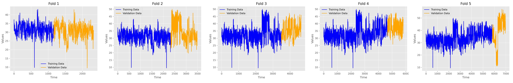

# lstm-training
training the LSTMs on BGD data

### LSTM orchestration: an overview
We implemented a pipeline using Metaflow [4] to train LSTM models on the BGD2 dataset. The pipeline is structured to ensure data integrity, effective preprocessing, and robust model training and evaluation. The implementation of this pipeline offers several advantages such as a structured and scalable approach to manage various steps involved in machine learning workflows.

 

<em>Fig 1. UML diagram (right) for pipelining and UI showing trained models (left).</em>

The pipeline is first broken down into ingestion, data preprocessing, model training, evaluation and logging into a cohesive pipeline. In the below sections, we talk about each of these steps in detail.

#### LSTM forecast: data preprocessing
The LSTM models were trained on real life building datasets from the Building Data Genome 2 (BGD2) dataset [2]. The BGD2 dataset has a large collection of 2 year hourly-data of 3,053 energy meters collected from 1,636 buildings.

##### Input pre-processing: Sorting the training data
The BGD2 dataset is a big mix of data over different building usage types. Since our aim is to have different LSTMs based on the input by the user, we sort the data based on the building usage type and sizes for training as mentioned below.

- **Building Usage Type**: Office, Education, Lodging/Residential. The image does show many primary building usage types but we focus on only these 3 for now.
- **Size in sq ft**: 1001-5000, 5001-10000, 10001-25000, 25001-50000, 50001-100000, 100001-200000, 200001-500000

 

<em>Fig 2. Image showing data filtered out of BGD2 dataset.</em>

The BGD2 dataset has definite building sizes but we categorize our data based on size bins defined in Comstock to be able to fetch a building to benchmark against. Due to lack of availability for some size bins in the BGD2 dataset, we were able to train a total number of 19 LSTM models.

##### Pipeline pre-processing: Dealing with missing data points
Since the BGD2 dataset is real measured data on buildings, most of the data in 2016 is missing due to faults in the electrical meters. This will cause problems during modeling as the LSTM will not be accurately able to capture the temporal dynamics in the data which will cause issues during inference. Hence, the 2016 data was skipped altogether.

 

<em>Fig 3. Image showing missing 2016 data in the BGD2 dataset and some 
			missing data points in the 2017 dataset.</em>

 

<em>Fig 4. Zoomed in version for one of the data points showing before (left) and after (right) filling.</em>

Even in the 2017 part of the dataset, the missing data points were addressed by employing a weighted average of ten nearest data points to ensure accurate and consistent information for the missing data points. 

##### Pipeline pre-processing: Picking the median
There exists diverse electricity usage patterns within the specific subsets of data filtered as seen in Fig 2, this is due to the broad size bins chosen and we need to aggregate this diverse data into a single column. For this, we pick the median of the data as it represents the central tendency which is a more accurate and robust measure since it mitigates the impact of outliers and extreme values. This provides a more reliable representation of energy consumption within each data subset.

Apart from dealing with outliers, using the central tendency helps maintain the integrity of the training data which is crucial for LSTM to identify and learn meaningful temporal dependencies. Furthermore, the central tendency helps the LSTM model to better generalize on the data which further reduces risk of overfitting to anomalous data points. 

##### Pipeline training: Cross-validation and training the model
To train an LSTM on time-series data, it is essential to prepare the data in a format so that the model can learn from it. This involves creating training examples from the input data where each example corresponds to sequence of input data and corresponding target values which is known as the sliding window approach. This method ensures that the temporal dynamics of the data are captured effectively, allowing the LSTM to learn the patterns over the specified time. Furthermore, the deep-learning framework used, torch expects the input for sequence models to be prepared in this way. 

 

<em>Fig 5. Example input using sliding window. 
The lookback value of 30 creates an input of past 30 hours data 
	so that the model can predict the 31st hour.</em>

Cross-validation is an important task to ensure that the model can generalize and is not heavily skewed towards one part of the training set. Furthermore, to cross-validate time-series data, it is crucial to maintain the temporal order of the data. Unlike typical datasets where shuffling is acceptable, time series data requires an approach that ensures this time-dependent structure is preserved. To do this, we utilize sklearn’s TimeSeriesSplit which sequentially splits data into training and validation sets whilst maintaining temporal order.

 

<em>Fig 6. Cross validation showing training and validation sets maintaining temporal order.</em>

##### Pipeline training: chosen hyperparameters
For our model, we consider a basic LSTM model as a reasonable starting point that balances complexity and computational efficiency. Our primary goal for forecasting is to standardize the modeling process that can be applied across various dataset and forecasting scenarios. Furthermore, using a fixed set of hyperparameters helps to simplify the modeling process and ensure the model’s performance is consistent and predictable.

We use a single-layer LSTM with a hidden size of 50. The single layer choice simplifies the model and reduces risk of overfitting which benefits us as well with shorter compute times. Similarly, a large hidden size can capture more complex patterns but at the cost of increased compute and overfitting risk.

##### Pipeline training: results of training
2 types of models were trained based on forecasting window: a short-term (30hr) vs a long-term (360 hr or 10 days) were trained on the BGD2 dataset input. We assess both these models by their mean absolute percentage error (MAPE) scores on the test set.

The short-term model achieves a low MAPE of ~ 4-5% on the test set which indicates that the model is able to capture the immediate temporal dependencies effectively. In comparison, the long-term model has an increase in MAPE scores which suggests that the model struggles to capture longer-term dependencies and trends. 

This is a common problem with LSTM models as they are more suited for short to medium-term predictions. However, it is important to note that our fixed choice of 50 hidden size could bottleneck the LSTM model’s capacity to retain the intricate relations and long-term trends. A higher hidden size provides more memory and computational power to the model enabling it to learn richer representations of the input data.

### To Reproduce
You will need the below libraries installed in your virtual Python environment or Conda environment.
  - joblib==1.4.2
  - matplotlib==3.9.1
  - metaflow==2.12.8
  - numpy==2.0.1
  - pandas==2.2.2
  - scikit_learn==1.5.1
  - torch==2.3.1

You will need the following libraries to run the Metaflow UI.
  - [metaflow-service](https://github.com/Netflix/metaflow-service)
  - [metaflow-ui](https://github.com/Netflix/metaflow-ui?tab=readme-ov-file)
  - Docker
